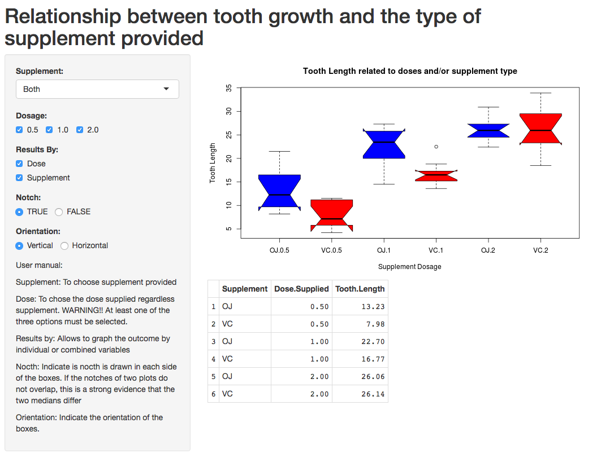

Tooth growth response to different supplement and doses
========================================================
author: Daniel ROMERO
date: April 2016

*Final project for Developing Data Poducts*

Introduction
========================================================

The  *"data product"* presented here consists of a User Graphical Interface (GUI) that allow to determine the treatment's eficacy for stimulating tooth growth  based on different supplements and doses combinations. 


This kind of analysis is very common for clinical and experimental trials, where specific dose levels determination is needed to achieve an effective therapy.


This dynamic web-based tool has been implemented using the **RStudio IDE** for R, an "open source" software packages-based extensively supported by users worldwide.


Graphical User Interface
========================================================



Data summary
========================================================

The **ToothGrowth** dataset  is available in the R base dataset. It comprises 60 observations corresponding to the tooth growth outcomes based on an experiment in guinea pigs using two different supplements: Orange Juice (OJ, n=30) or Vitamin C (VC, n=30) supplied at different dose levels: 0.5mg, 1.0mg, and 2.0mg (n=10 each one).

A summary of this __Dataset__ is shown bellow


```
     Length      Supp         Dose      
 Min.   : 4.20   OJ:30   Min.   :0.500  
 1st Qu.:13.07   VC:30   1st Qu.:0.500  
 Median :19.25           Median :1.000  
 Mean   :18.81           Mean   :1.167  
 3rd Qu.:25.27           3rd Qu.:2.000  
 Max.   :33.90           Max.   :2.000  
```

Web-based GUI Operation
========================================================

An  operative version of the implemented application can be found on the link bellow:

https://dromero.shinyapps.io/Data_Product_Project/

Documentation about its functioning is displayed in the inferior left side of the GUI. 

To update the graphic representation and see how the application works, you must change some of the input control to any of their possible values or stages. The GUI has been designed to be friendly and intutitive, as well as to automatically update the changes as configured by the user.

Contact Information : infoGUI@gmail.com
